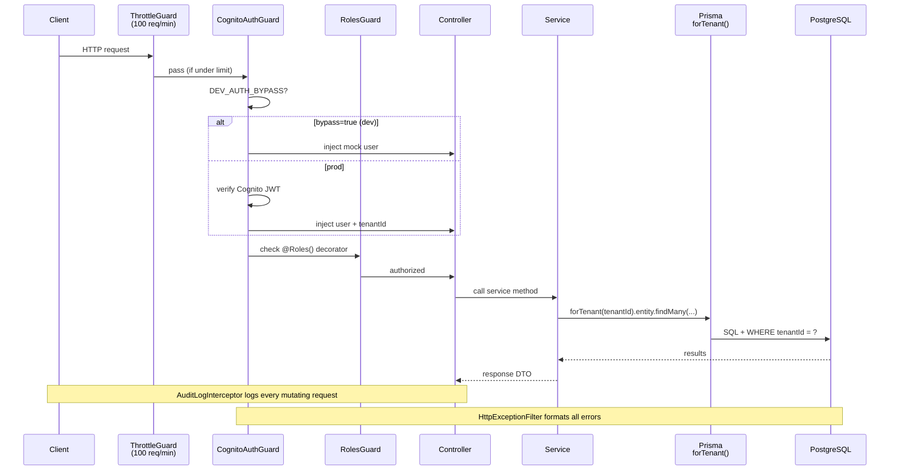

# Kelova Backend

NestJS 11 API powering the Kelova funeral operations platform. Multi-tenant SaaS — every request is scoped to a tenant via Cognito JWT (`custom:tenantId`).

- **API base:** `http://localhost:3001` (dev) · `https://api.vigilhq.com` (prod)
- **Swagger docs:** `http://localhost:3001/api/docs`
- **Platform:** AWS ECS Fargate + RDS PostgreSQL 16

---

## Quick Start

```bash
# 1. Start local database
docker-compose up -d

# 2. Install dependencies
npm install

# 3. Copy and populate env
cp .env.example .env

# 4. Run migrations + seed
npx prisma migrate dev
npx prisma db seed

# 5. Start dev server (port 3001)
npm run start:dev
```

The API starts with hot-reload. `DEV_AUTH_BYPASS=true` (in `.env`) skips Cognito and injects a mock user from the `x-dev-user` header — no AWS credentials required locally.

---

## Environment Variables

| Variable | Required | Description |
|---|---|---|
| `NODE_ENV` | yes | `development` / `production` / `test` |
| `PORT` | no | Default `3001` |
| `DATABASE_URL` | yes | PostgreSQL connection string |
| `REDIS_URL` | no | Redis (omitted in early stage) |
| `COGNITO_USER_POOL_ID` | prod | From CDK AuthStack output |
| `COGNITO_CLIENT_ID` | prod | From CDK AuthStack output |
| `COGNITO_REGION` | yes | `us-east-2` |
| `AWS_REGION` | yes | `us-east-2` |
| `AWS_S3_DOCUMENTS_BUCKET` | yes | From CDK DataStack output |
| `AWS_S3_ASSETS_BUCKET` | yes | From CDK DataStack output |
| `EMAIL_PROVIDER` | yes | `resend` (dev) or `ses` (prod) |
| `RESEND_API_KEY` | dev | Resend.com API key |
| `SES_FROM_ADDRESS` | prod | Verified SES sender address |
| `DEV_AUTH_BYPASS` | dev | `true` to skip Cognito locally |
| `N8N_WEBHOOK_*` | yes | n8n webhook URLs (see `.env.example`) |
| `N8N_WEBHOOK_KEY` | yes | Shared secret for internal webhooks |
| `INTERNAL_API_KEY` | yes | `@InternalOnly()` guard secret |
| `SENTRY_DSN` | prod | Leave blank until Phase 8 |
| `TEST_DATABASE_URL` | test | Separate Postgres on port 5433 |

---

## Architecture

### Request Lifecycle



> **Generated diagram:** `docs/images/request-flow.png` (`python scripts/generate-diagrams.py`)

### Module Dependency Graph

> See `docs/images/module-graph.png` for the full visual.

Key shared modules (imported by most feature modules):

| Module | Role |
|---|---|
| `PrismaModule` | Database client singleton |
| `EmailModule` | Resend / SES abstraction |
| `N8nModule` | Trigger n8n automation webhooks |
| `CronModule` | Local-dev cron stubs (not used in prod) |

### Multi-Tenancy

Every Prisma query is wrapped with `forTenant(tenantId)` — a Prisma extension that appends `WHERE tenantId = ?` to every operation. Tenant ID comes from the decoded Cognito JWT (`custom:tenantId`). The `src/__tests__/tenant-isolation.spec.ts` integration test verifies Tenant A cannot read Tenant B data.

### Auth Flow (Cognito)

```mermaid
flowchart TD
    A[Request arrives] --> B{DEV_AUTH_BYPASS?}
    B -- yes --> C[Read x-dev-user header\nInject mock AuthUser]
    B -- no --> D[Extract Bearer token]
    D --> E[aws-jwt-verify\nverifies Cognito JWT]
    E -- invalid --> F[401 Unauthorized]
    E -- valid --> G[Extract custom:tenantId\ncustom:role]
    G --> H[Sync cognitoSub → User record]
    H --> I[Attach user to request]
    C --> I
    I --> J[RolesGuard checks @Roles()]
```

---

## Module Index

All modules live in `src/modules/`. Click any module name to see its README.

### Phase 1 — Core Operations

| Module | Path | Responsibility |
|---|---|---|
| [auth](src/modules/auth/README.md) | `src/modules/auth/` | Cognito token exchange, user sync |
| [users](src/modules/users/README.md) | `src/modules/users/` | Staff user CRUD, role assignment |
| [cases](src/modules/cases/README.md) | `src/modules/cases/` | Case lifecycle (core domain entity) |
| [contacts](src/modules/contacts/README.md) | `src/modules/contacts/` | Family contacts per case |
| [intake](src/modules/intake/README.md) | `src/modules/intake/` | Public intake form, atomic case creation |
| [tasks](src/modules/tasks/README.md) | `src/modules/tasks/` | Per-case checklists + task templates |
| [documents](src/modules/documents/README.md) | `src/modules/documents/` | S3 presigned upload/download, PDF generation |
| [payments](src/modules/payments/README.md) | `src/modules/payments/` | Invoice line items, payment recording |
| [obituaries](src/modules/obituaries/README.md) | `src/modules/obituaries/` | Obituary text management |
| [signatures](src/modules/signatures/README.md) | `src/modules/signatures/` | E-signature capture and document signing |
| [follow-ups](src/modules/follow-ups/README.md) | `src/modules/follow-ups/` | Grief follow-up schedule (n8n-triggered) |
| [n8n](src/modules/n8n/README.md) | `src/modules/n8n/` | n8n webhook triggers + callback receiver |
| [health](src/modules/health/README.md) | `src/modules/health/` | `GET /health` — ALB health check |
| [analytics](src/modules/analytics/README.md) | `src/modules/analytics/` | Tenant dashboard metrics |
| [vendors](src/modules/vendors/README.md) | `src/modules/vendors/` | Vendor directory (cremation, florists, etc.) |
| [settings](src/modules/settings/README.md) | `src/modules/settings/` | Per-tenant configuration |
| [price-list](src/modules/price-list/README.md) | `src/modules/price-list/` | FTC GPL price list management |
| [calendar](src/modules/calendar/README.md) | `src/modules/calendar/` | Service event scheduling |
| [cemetery](src/modules/cemetery/README.md) | `src/modules/cemetery/` | Cemetery record keeping |
| [death-certificate](src/modules/death-certificate/README.md) | `src/modules/death-certificate/` | Death certificate filing |
| [cremation-auth](src/modules/cremation-auth/README.md) | `src/modules/cremation-auth/` | Cremation authorization forms |
| [first-call](src/modules/first-call/README.md) | `src/modules/first-call/` | Initial death notification intake |
| [merchandise](src/modules/merchandise/README.md) | `src/modules/merchandise/` | Casket / merchandise selection |
| [notes](src/modules/notes/README.md) | `src/modules/notes/` | Internal case notes |
| [preneed](src/modules/preneed/README.md) | `src/modules/preneed/` | Pre-need arrangement contracts |
| [super-admin](src/modules/super-admin/README.md) | `src/modules/super-admin/` | Cross-tenant admin functions |

### Phase 2 — Extended Features

| Module | Path | Status |
|---|---|---|
| [tracking](src/modules/tracking/README.md) | `src/modules/tracking/` | Decedent location tracking |
| [referrals](src/modules/referrals/README.md) | `src/modules/referrals/` | Referral source attribution |
| [memorial](src/modules/memorial/README.md) | `src/modules/memorial/` | Public memorial pages |
| [family-portal](src/modules/family-portal/README.md) | `src/modules/family-portal/` | Family-facing portal access |

### Phase 3 — Future (Stubs)

| Module | Path |
|---|---|
| [multi-location](src/modules/multi-location/README.md) | `src/modules/multi-location/` |
| [ai-obituary](src/modules/ai-obituary/README.md) | `src/modules/ai-obituary/` |
| [chatbot](src/modules/chatbot/README.md) | `src/modules/chatbot/` |
| [multi-faith](src/modules/multi-faith/README.md) | `src/modules/multi-faith/` |

---

## Database

ORM: Prisma 5.22 · Engine: PostgreSQL 16

```bash
# Apply pending migrations
npx prisma migrate dev

# Open Prisma Studio (browser DB browser)
npx prisma studio

# Regenerate Prisma client after schema changes
npm run prisma:generate

# Seed dev data (2 tenants, demo cases, staff users)
npx prisma db seed
```

Schema: `prisma/schema.prisma` — 44+ models, 11 enums. Every table has a `tenantId` column.

### Soft Delete Pattern

```
deletedAt set  →  90 days  →  archivedAt set  →  7 years  →  hard delete (n8n cron)
```

Applies to: `Case`, `Document`, `Vendor`, `User`. Matches FTC / funeral home legal retention requirements.

---

## Tests

```bash
npm run test              # Unit + integration (jest)
npm run test:coverage     # With coverage report (80% threshold)
npm run test:contract     # Contract tests only
npx jest test/tenant-isolation.e2e-spec.ts  # Tenant isolation E2E (needs TEST_DATABASE_URL)
```

Coverage is collected for all service files. The tenant isolation E2E test requires a separate Postgres instance on port 5433 (see `docker-compose.test.yml`).

---

## Scripts

| Command | Description |
|---|---|
| `npm run start:dev` | Dev server with file watch |
| `npm run build` | Compile to `dist/` |
| `npm run lint` | ESLint |
| `npm run type-check` | TypeScript type check (no emit) |
| `npm run prisma:generate` | Regenerate Prisma client |
| `npm run prisma:migrate` | Run migrations |
| `python scripts/generate-diagrams.py` | Regenerate `docs/images/*.png` |

---

## Deployment

The backend is deployed as a Docker container to ECS Fargate via GitHub Actions. The `deploy.yml` workflow:

1. Builds and tags the Docker image
2. Pushes to ECR (`vigil-backend` repository)
3. Updates the ECS service (`vigil-cluster`)
4. Runs `prisma migrate deploy` via a one-shot Fargate task

The Fargate task runs in a **public subnet with `assignPublicIp: true`** — there is no NAT Gateway (cost constraint). Security groups restrict inbound to ALB only.

---

## Guards & Decorators

| Guard / Decorator | Purpose |
|---|---|
| `CognitoAuthGuard` | Verifies JWT; injects `AuthUser` into request |
| `RolesGuard` | Enforces `@Roles(UserRole.ADMIN)` etc. |
| `InternalOnlyGuard` | Requires `x-kelova-internal-key` header (n8n callbacks) |
| `ThrottlerGuard` | 100 requests per 60 seconds per IP |
| `@Public()` | Skips `CognitoAuthGuard` for a route |
| `@InternalOnly()` | Marks a route for `InternalOnlyGuard` |
| `@Roles(...)` | Restricts route to listed roles |
| `@SuperAdminOnly()` | Restricts route to `SUPER_ADMIN` role |
| `@CurrentUser()` | Parameter decorator — extracts `AuthUser` from request |
